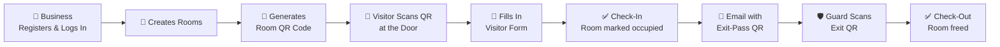
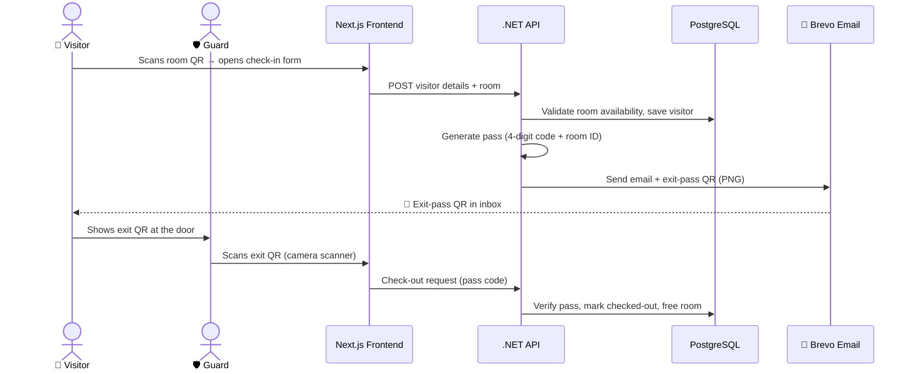
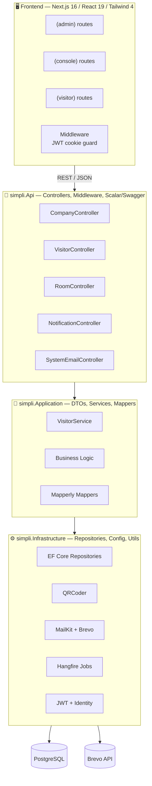
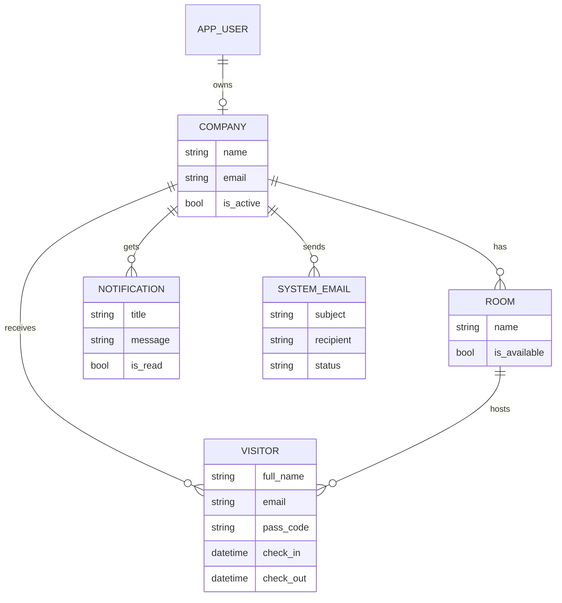

<div align="center">

# 🔷 Simpli

### *A frictionless security layer for the modern workspace*

**Simpli** is a modern visitor management system that replaces the paper logbook at your front desk with a fast, secure, QR-powered check-in and check-out experience.

[](https://dotnet.microsoft.com/)
[](https://nextjs.org/)
[](https://react.dev/)
[](https://www.postgresql.org/)
[](https://www.typescriptlang.org/)

🌐 **Live Demo** → [simply-io.vercel.app](https://simply-io.vercel.app/)

</div>

---

## 📖 About The Project

Every office, co-working space, and business still needs to answer one question: **"Who is inside my building right now?"**

Most workplaces answer it with a paper sign-in sheet — slow queues, illegible handwriting, zero security, no audit trail, and no way to tell who has actually left. **Simpli solves this end-to-end** with digital QR passes:

- 🏢 **Businesses** register, log in, create rooms/spaces, and generate a QR code for each one.
- 👤 **Visitors** simply scan the QR at the door, fill a short form, and check in — no app download, no reception queue.
- 📧 The system instantly **emails the visitor an exit-pass QR code**.
- 🛡️ **Security guards** scan that pass at the exit to check the visitor out, freeing the room.

The result: a clean, real-time, digital trail of everyone on-site — in and out.

---

## ✨ Features

| Area | Features |
|---|---|
| 🏢 **Business Console** | Registration & login (JWT), room creation & management, company profile (update / soft-delete / reactivate), dashboard |
| 🎟️ **QR Passes** | Room QR generation for check-in, unique 4-digit pass codes, exit-pass QR emailed as a PNG attachment |
| 👤 **Visitor Flow** | App-free check-in via QR scan, visitor form, instant email with exit pass, visitor records & listing |
| 🛡️ **Guard Station** | Camera-based QR scanner (`html5-qrcode`), one-scan check-out that frees the room |
| 🔔 **Notifications** | System email tracking & notification records per company |
| 📊 **Dashboard** | Recent visitors, analytics charts (`recharts`), printable passes (`react-to-print`) |
| 🤖 **Extras** | AI chat endpoint (Microsoft.Extensions.AI + OpenRouter), MCP tooling, real-time client via `socket.io-client` |

---

## 🔄 How It Works



### The Visitor Journey in Detail



---

## 🏗️ Architecture

Built with **Clean Architecture** on the backend — each layer is independent, testable, and swappable.



---

## 🗄️ Data Model



---

## 🛠️ Tech Stack

### Frontend
| Tool | Purpose |
|---|---|
| **Next.js 16 + React 19 + TypeScript** | App Router with `(admin)`, `(console)`, `(visitor)` route groups |
| **Tailwind CSS 4** | Modern, responsive UI |
| **html5-qrcode** | Camera-based QR scanning for guards |
| **qrcode.react / react-qr-code** | Rendering QR codes in-app |
| **Framer Motion** | Smooth animations |
| **Recharts** | Dashboard analytics |
| **react-to-print** | Printable visitor passes |
| **Socket.IO client** | Real-time updates |
| **Radix UI + lucide-react** | Accessible components & icons |

### Backend
| Tool | Purpose |
|---|---|
| **.NET 10 Web API / C#** | Clean Architecture: `Api` → `Application` → `Domain` → `Infrastructure` |
| **Entity Framework Core 10** | ORM with Fluent API configuration, snake_case conventions |
| **PostgreSQL (Npgsql)** | Primary datastore |
| **ASP.NET Identity + JWT** | Registration, login, claims (`CompanyId` via custom claims factory) |
| **QRCoder** | Exit-pass QR generation (error-correction level Q) |
| **MailKit + Brevo API** | Transactional email with QR attachment |
| **Hangfire** | Background job processing |
| **Riok.Mapperly** | Compile-time, high-performance DTO mapping |
| **Scalar / Swagger** | Interactive API docs |
| **API Versioning** | `Asp.Versioning` |
| **Microsoft.Extensions.AI + MCP** | AI chat endpoint & tooling |
| **xUnit + Moq + AutoFixture** | Unit tests (`simpli.Application.Tests`) |

---

## 📁 Project Structure

```text
simpli/
├── frontend/                  # Next.js 16 app
│   ├── app/
│   │   ├── (admin)/           # Admin routes
│   │   ├── (console)/         # Business console + QR scan
│   │   └── (visitor)/         # Public visitor check-in
│   ├── components/            # Forms, dashboard, GuardScanner
│   ├── lib/                   # Utilities
│   └── middleware.ts          # JWT cookie route guard
│
├── backend/                   # .NET 10 solution
│   ├── simpli.Api/            # Controllers, middleware, Program.cs
│   ├── simpli.Application/    # DTOs, services, mappers, queries
│   │   └── simpli.Application.Tests/   # xUnit tests
│   ├── simpli.Domain/         # Entities & enums (AppUser, Company, Room, Visitor…)
│   └── simpli.Infrastructure/ # EF Core, repositories, QRCoder, email, env
```

---

## 🚀 Getting Started

### Prerequisites
- **.NET 10 SDK**
- **Node.js 20+** & npm
- **PostgreSQL**

### 1️⃣ Clone

```bash
git clone https://github.com/codewithgradi/simpli.git
cd simpli
```

### 2️⃣ Backend

Create a `.env` file in the backend root:

```env
# Database
DB_HOST=localhost
DB_PORT=5432
DB_NAME=simpli_db
DB_USER=postgres
DB_PASSWORD=your_password

# Auth
JWT_SECRET=your_secret_key

# Environment (dev | prod)
CurrentEnviroment=dev

# Email (Brevo)
SystemEmail=your-sender@example.com
AppPassword=your_password
ApiKey=your_brevo_api_key
BrevoLink=https://api.brevo.com/v3/smtp/email

# AI (optional)
OpenAi__ApiKey=your_key
OpenAi__OpenRouter=your_key
```

Run migrations & start the API:

```bash
dotnet ef database update --project simpli.Infrastructure
dotnet run --project simpli.Api
```

### 3️⃣ Frontend

```bash
cd frontend
npm install
npm run dev
```

Open **http://localhost:3000** 🎉

### 4️⃣ Run Tests

```bash
dotnet test backend/simpli.Application.Tests
```

---

## 🌍 The Problem → Simpli's Answer

| 😩 The old way (paper logbook) | 🚀 The Simpli way |
|---|---|
| Long queues at reception | Visitors check in in seconds, contact-free |
| Illegible, unreliable records | Clean, structured digital visitor records |
| No proof of who left the building | Exit QR scan = verified check-out trail |
| Zero visibility for security | Real-time dashboard of everyone on-site |
| Sheets that can be read by anyone | JWT-protected console, soft-delete & audit-friendly data |

---

## 🗺️ Roadmap

- [ ] Docker support & CI/CD pipeline
- [ ] Integration & expanded unit test coverage
- [ ] Caching & Redis integration
- [ ] API versioning maturity & rate limiting
- [ ] Logging & monitoring (structured logs, metrics)
- [ ] Real-time notifications expansion

---

## 🤝 Contributing

Issues and pull requests are welcome! For major changes, please open an issue first to discuss what you'd like to change.

## 📬 Contact

**Gradi Puata** — [@codewithgradi](https://github.com/codewithgradi)

Project Link: [Live Link](https://simply-io.vercel.app/)

<div align="center">
Made with 💙 and a lot of ☕
</div>
